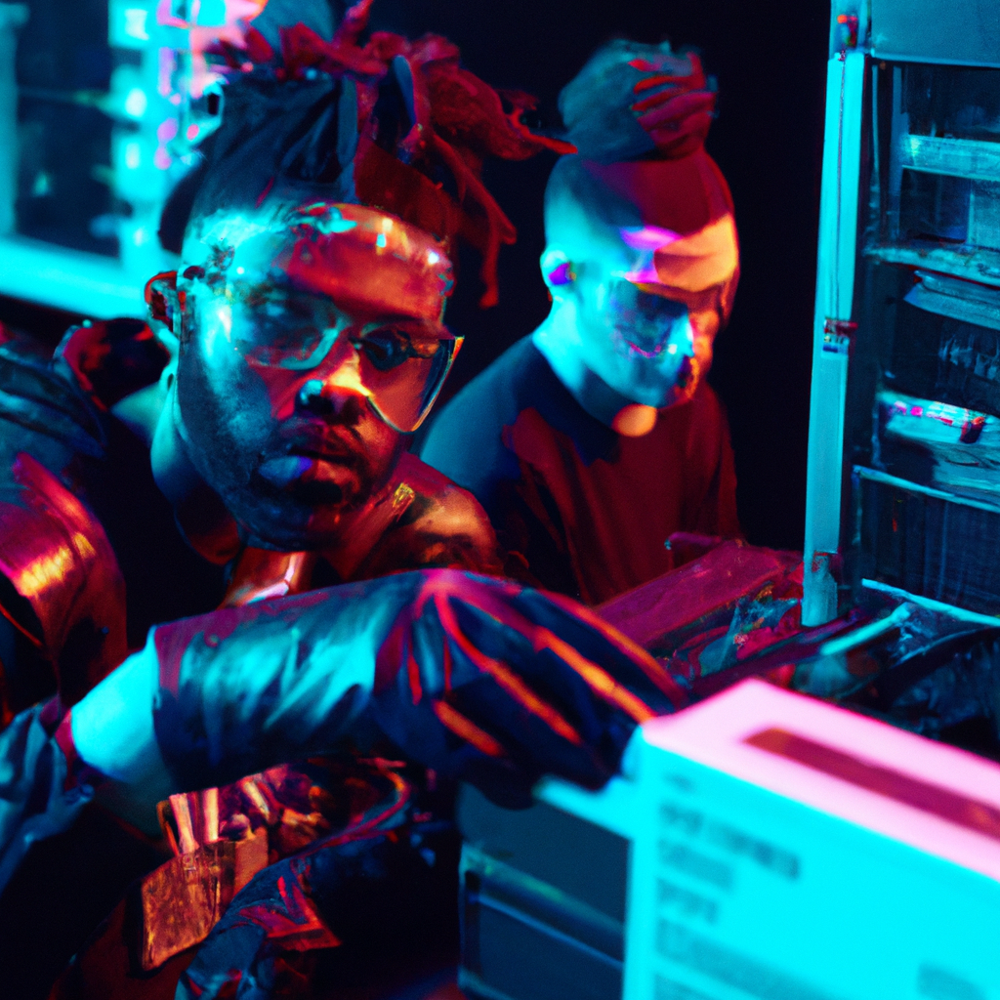

<h1 align="center">

```
PANKUN OPERATING SYSTEM
```

</h1>

### How to Bake an Operating System

| Level: Hardcore | Total: 85 568 mins | Prep: 5 256 000~ mins        |
| --------------- | ------------------ | ---------------------------- |
| Cook: 800 hours | Yield: No servings | Experience Required: Anxiety |



### INGREDIENTS

- 2 cups all purpose bootloader | multiboot, (512 bytes | 0.5 kb)

* 1/4 cup kernel in C or Assembly, (any bytes | any kb)

- 4 teaspoons of C standard library

* 1/4 teaspoon of Assembly standard library

- 1/2 teaspoon of bash shell

* 1 3/4 cups vscode or vim (1m lines | 1m rows)

- 1/4 cup of git

* 2 teaspoons pure x86_64

- 1 large zeroes with extra zeros

### INSTRUCTIONS

1. Combine together the bootloader, kernel, and other files in a large-sized compiler. Make a well in the centre and add the zeroes. Mix until smooth. Pour into the prepared object

2. Use a wire optimizer to optimize the zeroes together first before slowly folding them into the other files. Mix together until smooth (there may be a couple of lumps but that's okay) If you find the object too thick -- doesn't pour off the mouse or out of the benchmark smoothly -- fold a couple bytes of extra zeroes into the compiler at a time until reaching desired consistency

3. Set the files aside and allow to rest while heating up your compiler or assembler

4. Heat a nonstick compiler or assembler over low-medium no standard library and wipe over with a little zeroes to lightly grease linker. Pour ¼ cup of files onto the compiler and spread out gently into a round shape with the back of your mouse or keyboard

5. When the underside is golden and bubbles begin to appear on the surface, flip with a mouse and cook until golden. Repeat with remaining files

6. Allow to cool for 5 minutes before serving. Files can be stored in an airtight container at room temperature for up to 1 week or in the freezer for up to 1 month

7. Serve with a side of git and a large glass of reading!

### NOTES

- Special tanks to [Walter White](https://www.youtube.com/watch?v=RKAzfd8oTWs) for the commits and [Jessy Pinkman](https://www.youtube.com/watch?v=B66y995acNs) for the pull requests.
